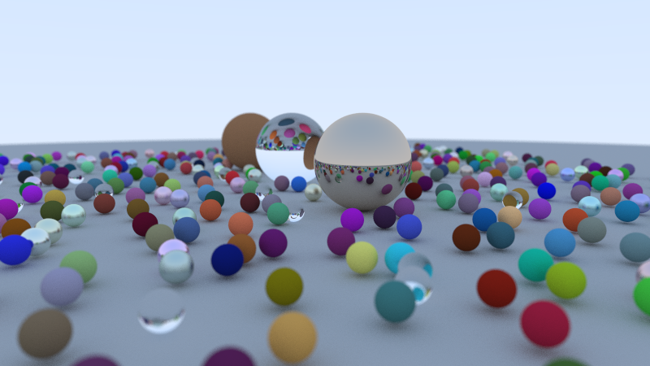

# Absolomb
A simple RayTracer Project, based on Peter Shirley's implementation of the same, from his book "Ray Tracing in a Weekend"

## Description 
This RayTracer Project was done to learn the ins and outs of Computer Graphics, even though it runs on the CPU, instead of the GPU.
It uses almost no APIs for the actual ray tracing, written entirely in C++, other than SFML for window rendering, which displays the image generated by this program on a window. It also generates a .ppm file as its primary output. Additionally, it implements CPU multithreading to improve render time of image

