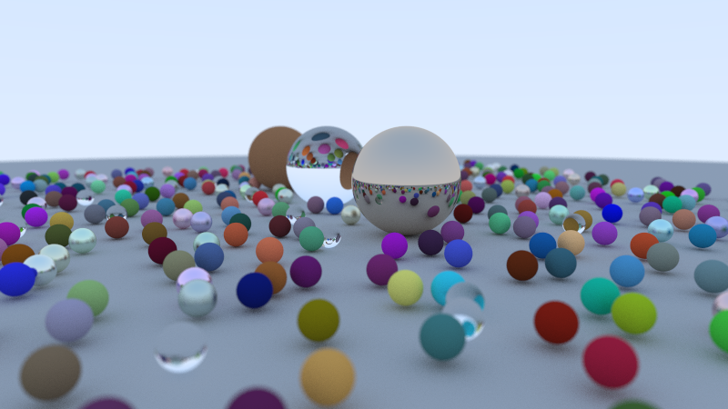
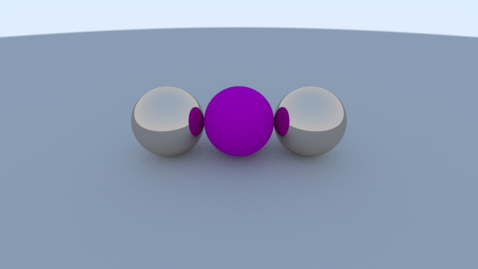

# Absolomb
A simple **RayTracer** Project, based on Peter Shirley's implementation of the same, from his book "Ray Tracing in a Weekend"

## Description 
This Ray Tracer project was created to explore the fundamentals of **Computer Graphics**. It runs on the **CPU** rather than the **GPU** and uses almost no external APIs for ray tracing, being written entirely in **C++**, except for **SFML**, which handles window rendering. The program displays the generated image in a window and outputs a `.ppm` file as the primary result. Additionally, it utilizes **CPU multithreading** to improve rendering times.

## Showcase



## How to Build the Project
**NOTE:** Currently, this project has only been tested on **Windows**. (Support for building and running it on **Linux** and **macOS** is in progress.)

### Prerequisities:
- Git
- CMake
- C++ Compiler (preferably have Visual Studio installed and use MSVC, other compilers not tested yet)

### Dependencies:
- SFML: 2.6.1 (Prepackaged with repo, no need to download/install separately)

### Steps to build:

```bash
git clone https://github.com/edw0rd21/Absolomb.git
cd Absolomb

# To compile the source
sh build.sh

# To run the executable
sh run.sh
 ```
    
### TODO:
- Add support for other OS
- Add support for additional C++ compilers
